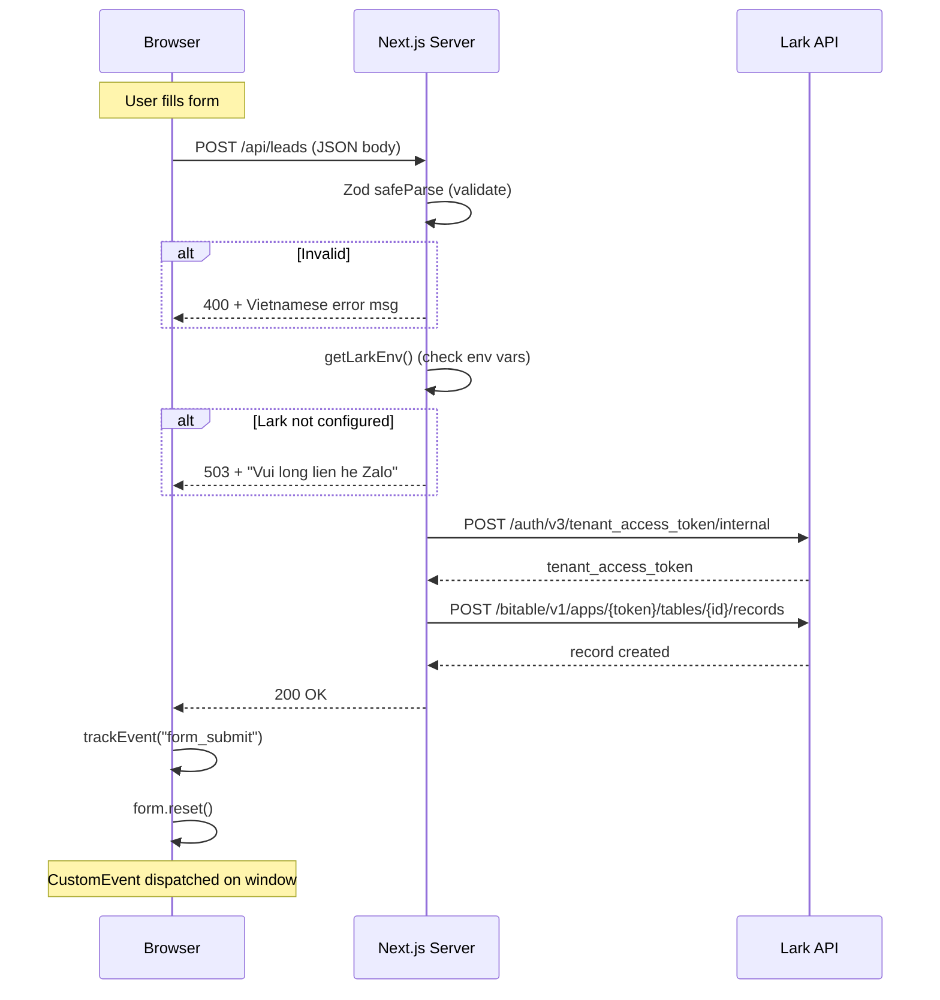

# Codebase Summary — Thuy Duong SSI Landing

> **Last updated:** 2026-05-22 &nbsp;|&nbsp; **Version:** 0.1.0

---

## 1. File Tree

```
ThuyDuongSSi/
├── app/                              # Next.js App Router (4 files)
│   ├── layout.tsx                    # Root layout: metadata, fonts, Vercel Analytics
│   ├── page.tsx                      # "use client" — single-page landing, 9 sections
│   ├── globals.css                   # 938 lines: CSS custom properties + all styles
│   └── api/leads/route.ts            # POST endpoint: Zod validate → Lark create
│
├── src/                              # Source modules (7 files)
│   ├── components/landing/
│   │   ├── LeadForm.tsx              # "use client" — 7-field form, 4 states, tracking
│   │   └── FooterLinks.tsx           # Server component — disclaimer + contact links
│   ├── content/
│   │   └── landing.ts                # Single source of truth: all copy, links, stats
│   ├── lib/
│   │   ├── env.ts                    # Lark env validator (4 env vars)
│   │   ├── lark.ts                   # Lark API: tenant token + Bitable record create
│   │   ├── lead-schema.ts            # Zod schema: 4 required + 5 optional fields
│   │   └── tracking.ts              # UTM reader + custom event dispatcher
│   └── styles/
│       └── design-tokens.ts          # TypeScript design token export (not imported)
│
├── public/assets/selected/           # 7 web-ready images (~1.4MB)
│   ├── hero-portrait.png             # Hero portrait (136KB)
│   ├── proof-kol-2025.jpg
│   ├── proof-retail-awards-2024.jpg
│   ├── proof-branch-award-2025.jpg
│   ├── training-team-ai-2025.jpg
│   └── ... (+2)
│
├── docs/                             # Documentation
│   ├── project-overview-pdr.md       # PDR — project requirements & status
│   ├── codebase-summary.md           # This file
│   ├── code-standards.md             # Code conventions
│   ├── system-architecture.md        # System architecture
│   └── superpowers/plans/            # Project plan phase files
│
├── assets/                           # Raw assets (gitignored subdirs, 1960 files)
├── design-tokens.json                # Design tokens in JSON (gitignored)
├── .env.example                      # Environment variables template
├── next.config.mjs                   # Next.js config (images.unoptimized: true)
├── tsconfig.json                     # TypeScript strict, bundler resolution, path alias @/*
├── package.json                      # Dependencies & scripts
└── README.md                         # Project readme
```

---

## 2. Lines of Code

```
app/page.tsx                         247
app/globals.css                      938
app/layout.tsx                        39
app/api/leads/route.ts                34
src/components/landing/LeadForm.tsx   108
src/components/landing/FooterLinks.tsx 25
src/content/landing.ts                68
src/lib/lark.ts                       74
src/lib/env.ts                        18
src/lib/lead-schema.ts                15
src/lib/tracking.ts                   15
src/styles/design-tokens.ts           37
─────────────────────────────────────
Total source (TSX/TS)                678
Total CSS                            938
Grand total                        1,616
```

---

## 3. Key Modules & Responsibilities

| Module | Responsibility |
|--------|---------------|
| `app/page.tsx` | Page shell: nav, scroll listener, composes all 9 sections from `landingContent` |
| `app/layout.tsx` | Root HTML: metadata, Open Graph, Google Fonts CDN, Vercel Analytics injection |
| `app/globals.css` | Complete design system: custom properties, layout, components, responsive breakpoints |
| `app/api/leads/route.ts` | API route: Zod validation → Lark env check → `createLeadRecord()` → response |
| `src/components/landing/LeadForm.tsx` | Client form: 4 states (idle/loading/success/error), UTM capture, custom events |
| `src/components/landing/FooterLinks.tsx` | Server footer: brand disclaimer, contact links from content layer |
| `src/content/landing.ts` | Content layer: links, stats[], proofs[], roles[], training[] — all copy in one file |
| `src/lib/lark.ts` | Lark API: `getTenantAccessToken()` + `createLeadRecord()` — 2 API calls per lead |
| `src/lib/env.ts` | Environment: reads 4 `LARK_*` vars, returns `{ configured, missing }` |
| `src/lib/lead-schema.ts` | Validation: Zod schema with Vietnamese error messages |
| `src/lib/tracking.ts` | Analytics: `getUtmCampaign()` from URL params + `trackEvent()` custom event |

---

## 4. Data Flow



---

## 5. External Service Integrations

### Lark (Feishu) Bitable

| Aspect | Detail |
|--------|--------|
| Auth endpoint | `POST https://open.larksuite.com/open-apis/auth/v3/tenant_access_token/internal` |
| Base API | `POST https://open.larksuite.com/open-apis/bitable/v1/apps/{appToken}/tables/{tableId}/records` |
| Fields written | `created_at`, `full_name`, `email`, `phone_zalo`, `role_interest`, `experience_level`, `social_link`, `source`, `utm_campaign`, `status`, `notes` |
| Token strategy | Fresh token per request (no caching) |
| Graceful degradation | 503 with user-friendly Vietnamese message when env vars missing |

### Vercel Analytics

| Aspect | Detail |
|--------|--------|
| Package | `@vercel/analytics` (latest) |
| Integration | `<Analytics />` component in root layout |
| Env var | `NEXT_PUBLIC_ANALYTICS_PROVIDER=vercel` |

### Custom Tracking

| Event | Trigger | Payload |
|-------|---------|---------|
| `landing:event` (CustomEvent) | On successful form submit | `{ detail: { name: "form_submit" } }` |
| UTM capture | On form submit | `utm_campaign` from URL query string |

---

## 6. Environment Variables

| Variable | Required | Used In | Description |
|----------|----------|---------|-------------|
| `LARK_APP_ID` | Yes | `src/lib/env.ts` → `src/lib/lark.ts` | Lark application ID |
| `LARK_APP_SECRET` | Yes | `src/lib/env.ts` → `src/lib/lark.ts` | Lark application secret |
| `LARK_BASE_APP_TOKEN` | Yes | `src/lib/env.ts` → `src/lib/lark.ts` | Lark Base app token |
| `LARK_TABLE_ID` | Yes | `src/lib/env.ts` → `src/lib/lark.ts` | Lark Bitable table ID |
| `NEXT_PUBLIC_ANALYTICS_PROVIDER` | No | `@vercel/analytics` | Set to `vercel` |

**Copy `.env.example` → `.env.local`** and fill the 4 Lark variables.

When Lark env is missing, `POST /api/leads` returns **503** with: _"Form dang cho ket noi Lark. Vui long lien he Zalo neu can gap."_
