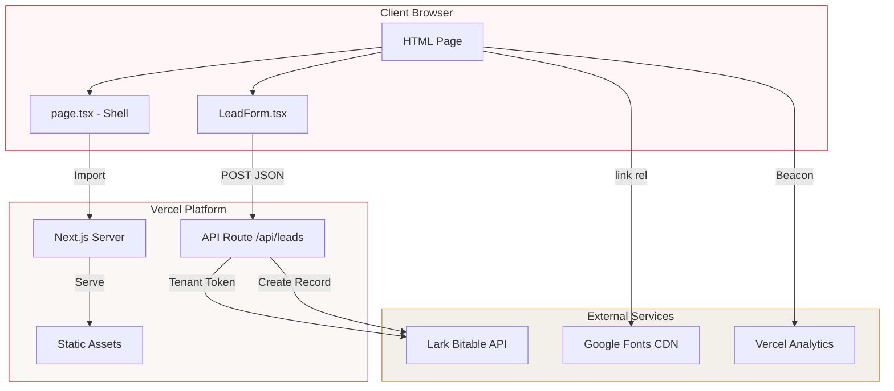
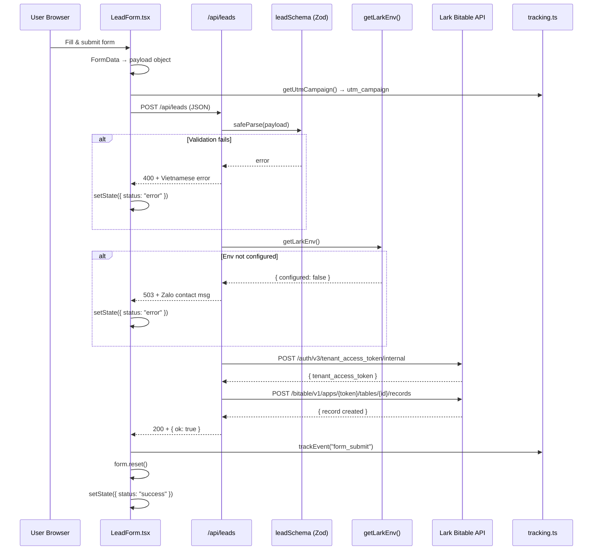

# System Architecture — Thuy Duong SSI Landing

> **Last updated:** 2026-05-22 &nbsp;|&nbsp; **Version:** 0.1.0

---

## 1. Overall Architecture



---

## 2. Component Tree

```
RootLayout (layout.tsx) [Server Component]
├── <html lang="vi">
├── <head> — Google Fonts CDN links
├── <body>
│   ├── Home (page.tsx) ["use client"]
│   │   ├── <nav> — Fixed, scroll-aware blur
│   │   │   ├── .brand — "TD" mark + "Thuy Duong Invest"
│   │   │   └── .nav-links — Uy tin / Co hoi / Ung tuyen
│   │   ├── <section.hero> — Portrait + CTA + SSI badge
│   │   ├── <section.stats-strip> — 5 stat items from landingContent.stats
│   │   ├── <section.proof-bg> — 3 proof cards from landingContent.proofs
│   │   ├── <section.opp-bg> — 4 role cards from landingContent.roles
│   │   ├── <section.training> — Image + 5 checklist items
│   │   ├── <section#apply> — Copy + LeadForm
│   │   │   └── LeadForm (LeadForm.tsx) ["use client"]
│   │   │       ├── 7 form fields (name, phone, email, role, experience, social, note)
│   │   │       ├── Submit button → POST /api/leads
│   │   │       └── Status message (idle/loading/success/error)
│   │   ├── <section.links> — 4 bio links (SSI, Zalo, TikTok, Facebook)
│   │   └── FooterLinks (FooterLinks.tsx) [Server Component]
│   │       ├── Brand disclaimer
│   │       └── 4 footer links (phone, email, Facebook, TikTok)
│   └── <Analytics /> — Vercel Analytics
```

---

## 3. Data Flow: Form Submission → Lark Base



### Lark Field Mapping

| TypeScript (camelCase) | Lark Base (snake_case) | Source |
|------------------------|------------------------|--------|
| `fullName` | `full_name` | Form input |
| `email` | `email` | Form input |
| `phoneZalo` | `phone_zalo` | Form input |
| `roleInterest` | `role_interest` | Form select |
| `experienceLevel` | `experience_level` | Form select |
| `socialLink` | `social_link` | Form input |
| `note` | `notes` | Form textarea |
| `source` | `source` | Hardcoded `"landing"` |
| `utmCampaign` | `utm_campaign` | URL query param |
| (generated) | `created_at` | `new Date().toISOString()` |
| (generated) | `status` | Hardcoded `"new"` |

---

## 4. State Management

| State | Location | Type | Scope |
|-------|----------|------|-------|
| Nav scroll flag | `page.tsx` `useState<boolean>` | `boolean` | Page-level |
| Form status | `LeadForm.tsx` `useState<FormState>` | Discriminated union | Component |
| UTM campaign | URL query string | Read-only | Browser |
| Custom tracking | `window.dispatchEvent` | Event-based | Browser |

**No global state, no context providers, no state management library.**

---

## 5. Routing

- **Single-page application** — no client-side routing
- **Anchor-based navigation:** `#top`, `#proof`, `#opportunity`, `#apply`
- **One API route:** `POST /api/leads`
- **No dynamic routes, no middleware, no rewrites/redirects**

---

## 6. Styling Architecture

```
globals.css
├── :root (27 custom properties)
│   ├── Colors: --red, --red-deep, --red-bright, --cream, --paper,
│   │           --warm-white, --ink, --ink-soft, --muted, --muted-light,
│   │           --charcoal, --gold, --gold-light, --success,
│   │           --border, --border-light
│   ├── Radii: --radius-sm (4px), --radius-md (8px), --radius-lg (16px), --radius-xl (24px)
│   ├── Shadows: --shadow-card, --shadow-elevated, --shadow-glow
│   └── Spacing: --space-x, --space-y, --max-w (1240px)
├── Reset: box-sizing, scroll-behavior, font-smoothing
├── Base: body (Manrope), headings (Playfair Display), links, forms
├── Components: .nav, .hero, .stats-strip, .section, .proof, .opp, .training, .form, .links, .footer
├── Utility: .btn, .btn-primary, .btn-outline, .form-field, .form-msg
└── Responsive: @media (max-width: 1024px), (max-width: 860px), (max-width: 560px)
```

**Font stack:**
- Headings: `'Playfair Display', Georgia, serif` (weight: 500, 700, 900)
- Body: `'Manrope', system-ui, -apple-system, sans-serif` (weight: 400–800)

---

## 7. Deployment Architecture

```
┌─────────────────────────────────────────────────────┐
│                      Vercel                          │
│                                                     │
│  ┌──────────────┐  ┌────────────────┐              │
│  │ Static Files  │  │ Serverless Fn  │              │
│  │ (HTML, CSS,   │  │ POST /api/leads│              │
│  │  JS, images)  │  │                │              │
│  │               │  │ → Zod validate │              │
│  │ Served via    │  │ → Lark API     │              │
│  │ Vercel Edge   │  │ → Response     │              │
│  └──────────────┘  └────────────────┘              │
│                                                     │
│  Env: LARK_APP_ID, LARK_APP_SECRET,                  │
│        LARK_BASE_APP_TOKEN, LARK_TABLE_ID           │
└─────────────────────────────────────────────────────┘
```

- **Build:** `next build` (static export disabled, API routes as serverless functions)
- **Images:** `unoptimized: true` — served as-is from `public/`
- **Custom domain:** not configured (using Vercel subdomain)
